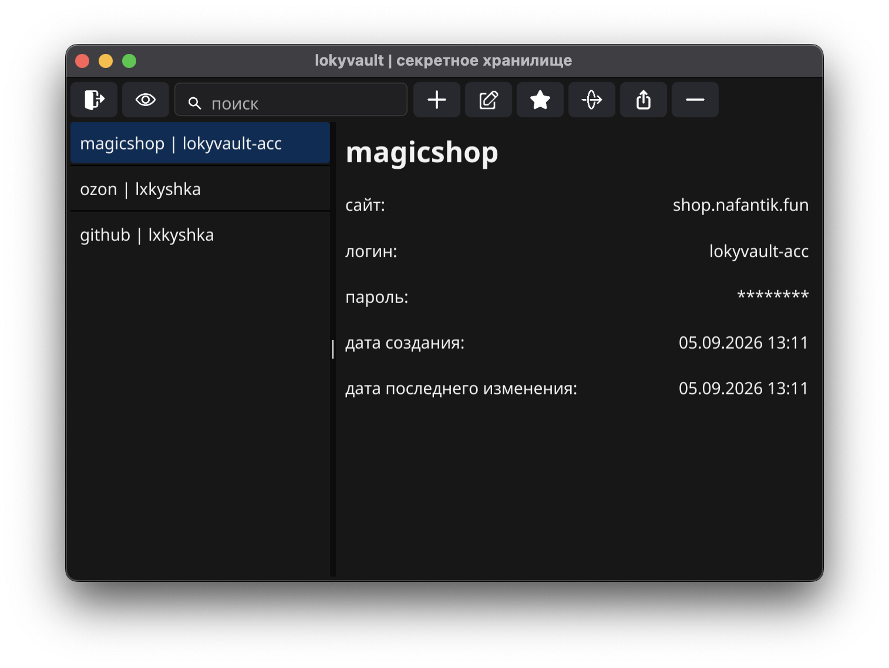

## lokyvault — кроссплатформенный менеджер паролей с правдоподобным отрицанием.

приложение реализовано на **go** с gui-интерфейсом **fyne** и предоставляет следующие функциональные возможности:

  \> **двойное хранилище: основное и секретное**, доступ к которым осуществляется по отдельным паролям(при входе в секретное нужны оба пароля), что позволяет разделять обычные и конфиденциальные данные.
  
  \> **шифрование aes-256-gcm** с получением ключа через **argon2id(5 итераций, 64 мб памяти, 4 потока)**, что повышает устойчивость к брутфорсу.
  
  \> аутентификация на основе пароля длиной **не менее 8 символов**, **обязательно содержащей буквы**(допускаются цифры, спецсимволы & все прочие unicode символы), **проходящей по стойкости** через функцию, что повышает защиту по сравнению с числовыми pin-кодами.

  \> реализован **panic пин**, при вводе которого хранилище блокируется до ручной разблокировки сохраненными данными.
  
  \> **возможен импорт и экспорт** существующего хранилища в формате .lvault, что позволяет удобно переносить базу паролей.

  \> **размер хранилища фиксирован — 30мб**. возможно записать **до 6999 обычных & 23699 секретных объектов**.

  \> можно быстро **передавать объекты через qr** человеку, не установившему lokyvault.
  
  \> **все ключи и пароли затираются в памяти** после использования, что повышает защиту от утечки данных при дампе оперативной памяти. также, буфер обмена с паролями очищается через 5 минут.
  
  \> используется **чанковая(1 чанк = 1 кб) архитектура базы паролей**, что позволяет **перемешивать основное и секретное хранилища**.
  
  \> **кроссплатформенная поддержка** Windows, macOS, Debian, Android & iOS.

  
   

  
   

  
   

  
   

  
   

  
   

lokyvault распространяется под лицензией [GNU General Public License v3.0 (GPLv3)](LICENSE).

[by lxkyshka ](https://github.com/lokyshka)